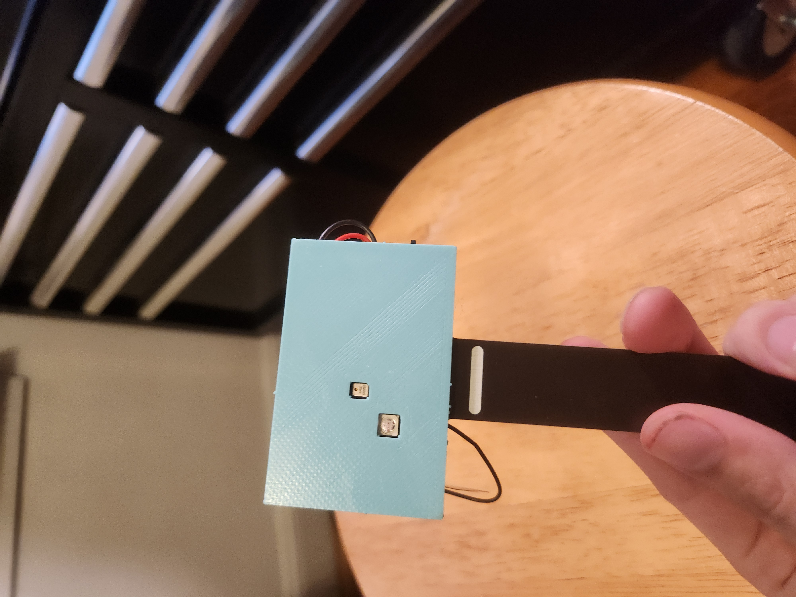
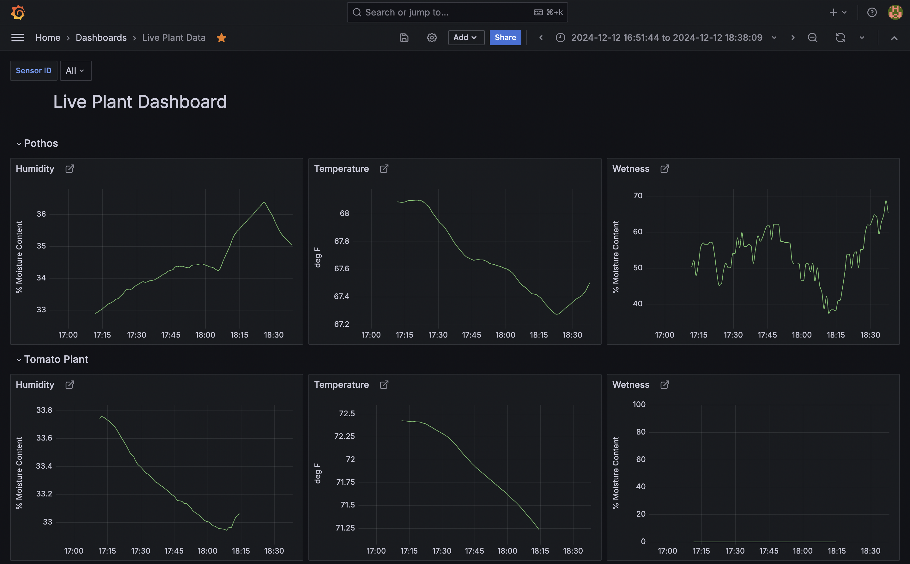
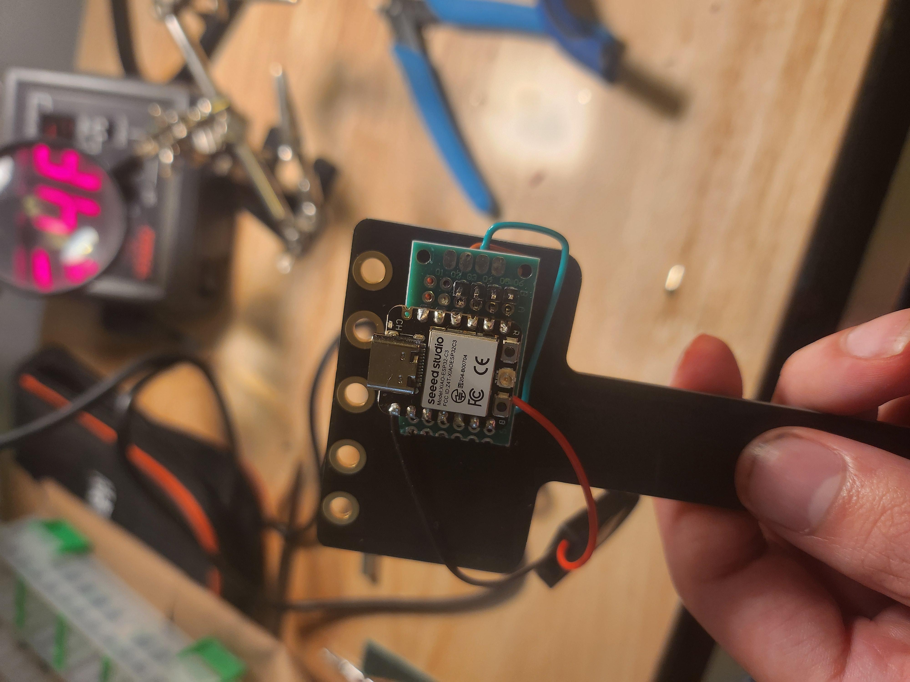
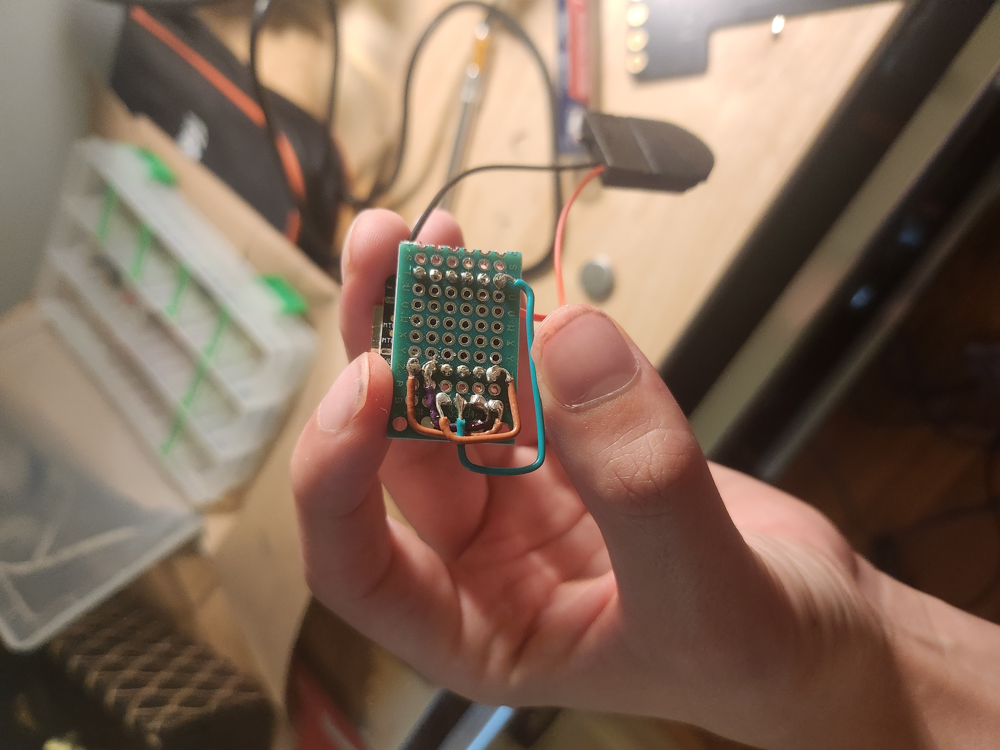
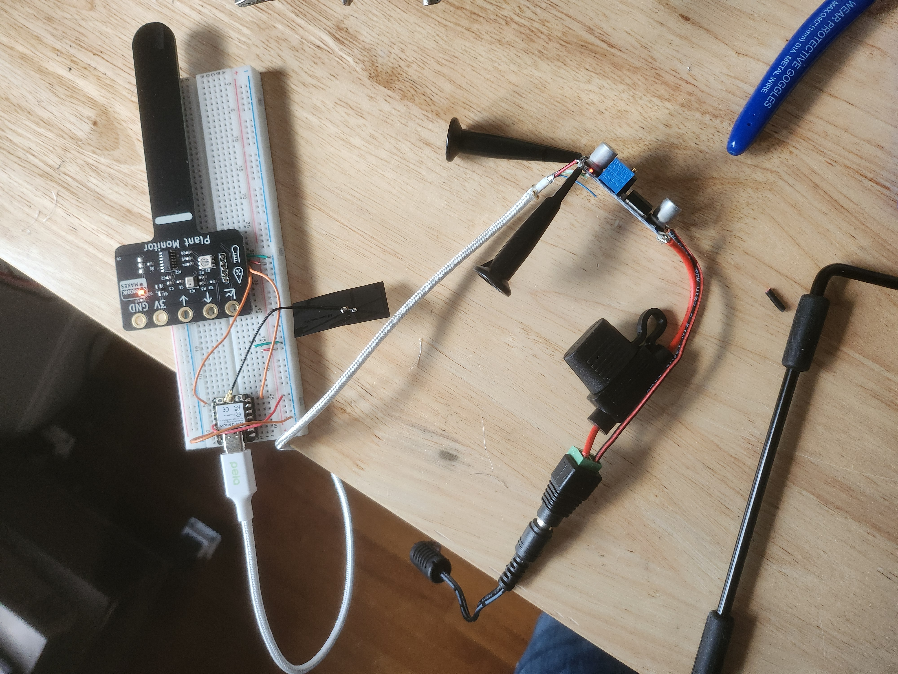

### Live Plant Dashboard

I am creating this project as a three year anniversary gift to my partner. She has dozens of plants, but occasionally will forget to water one for a little while, or will go on vacation and get her watering cycle tripped up. So I have taken the clear next step, create a dozen cheap IOT devices that measure critical plant data, have them all report that data to a central home server so they can be recorded in a time series database, and then create a useful dashboard to display that data and keep tabs on her plants.

### Misc images to help if someone out there tries to replicate

