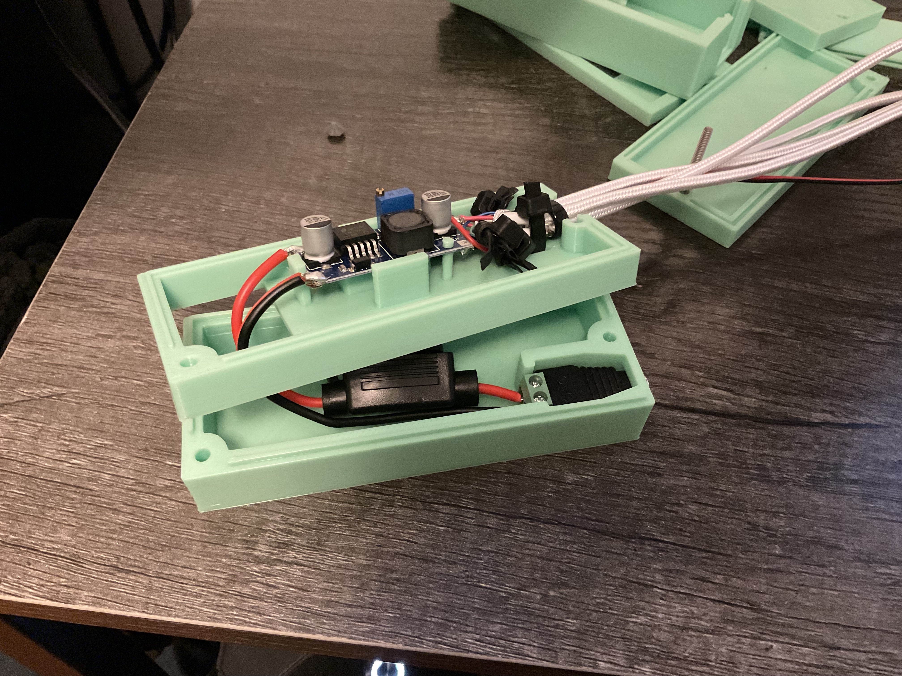
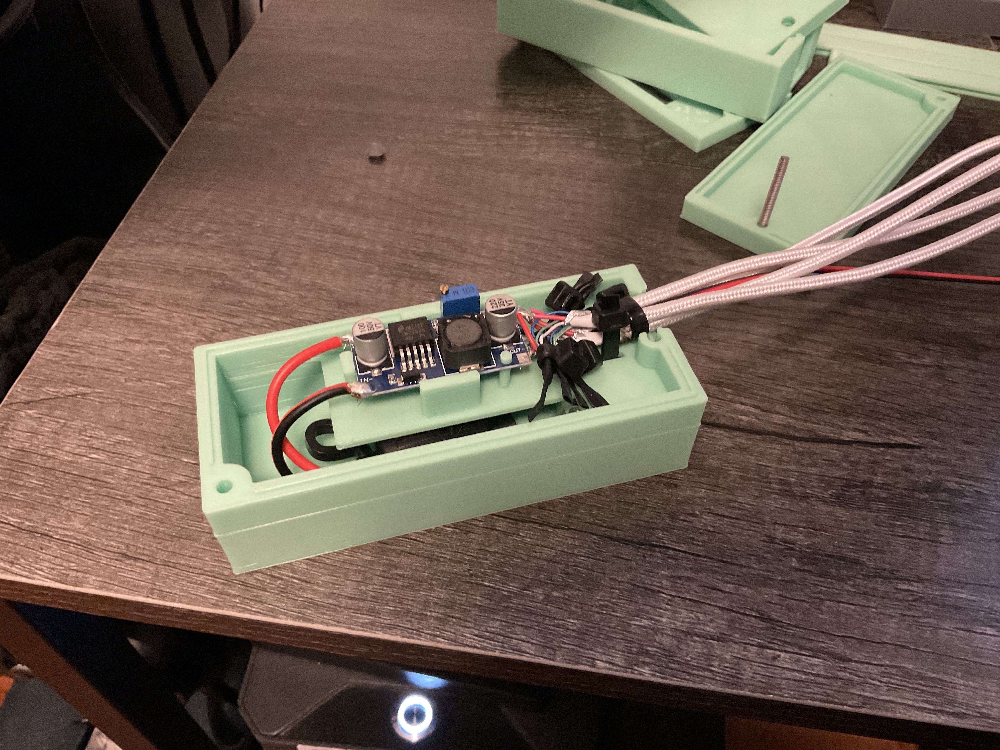
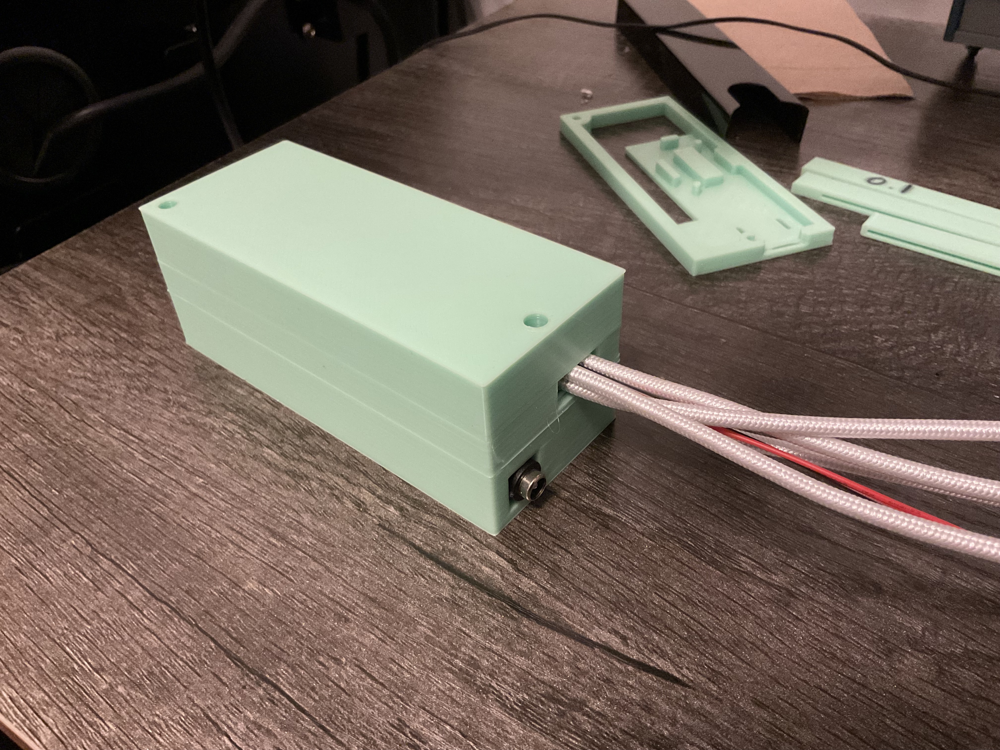

## General Description of Project Hardware
The iot devices (of which I am building a dozen to start) are fairly simple and compose of the monk makes plant monitor: https://monkmakes.com/pmon
and the Seeed Studio XIAO ESP32C3. The plant monitor is recording humidity, temperature, and light. The esp32 pulls the plant monitor every minute for data, and then report that do a prometheus database running on a home server (which is just a Beelink mini PC on our home wifi)

## Powering the Seeed Studio ESP32C3
The Seeed Studio ESP32C3 has issues on some boards with powering over battery, so I have resorted to powering them all over USB C. I am using a AC to DC converter that I had in the drawer from a previous project. This powers the board at 12V so I have connected it to a buck converter which is then soldered to a bunch of cheap USB-C cables cut in half. Photos below and CAD files in the 3D files folder. I also put attached a fuse to the DC input just in case.

These components are attached with 5-40 screws. iirc they are 1 1/4".